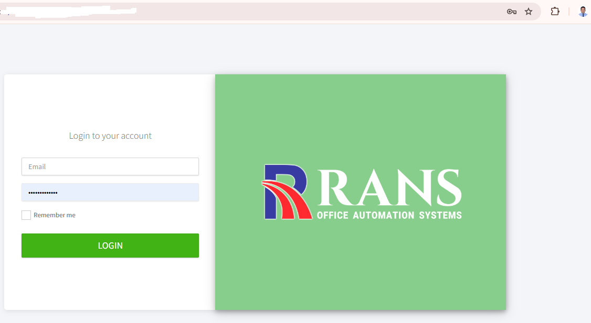
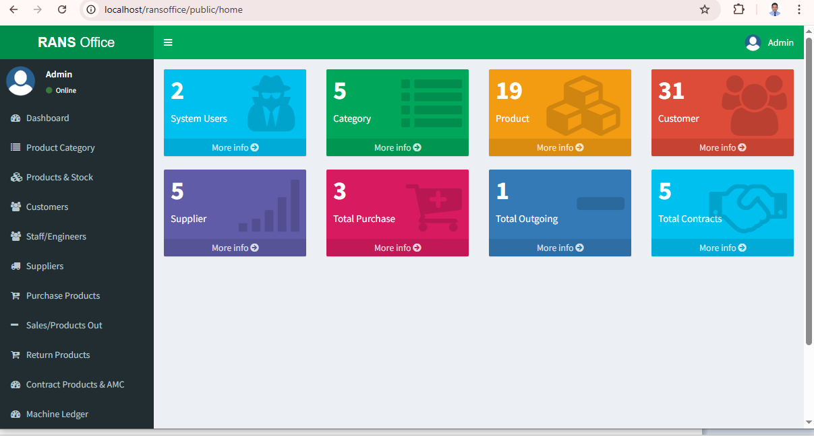
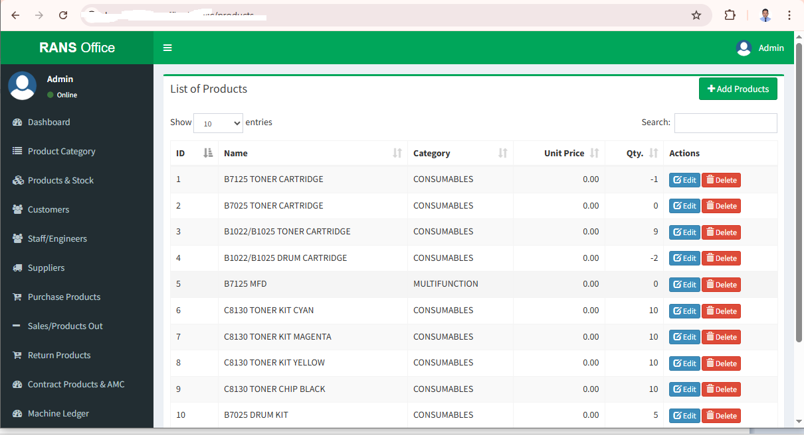
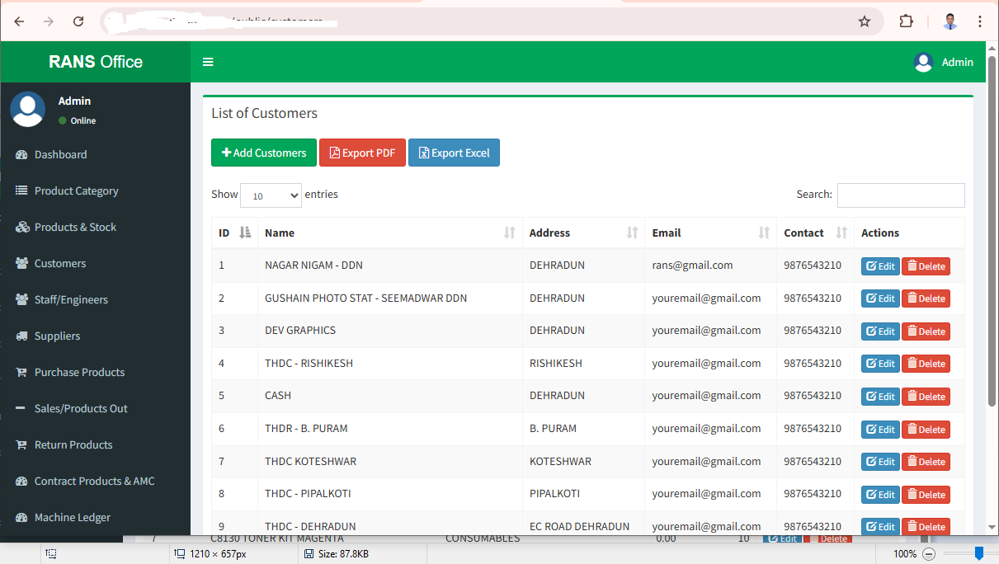
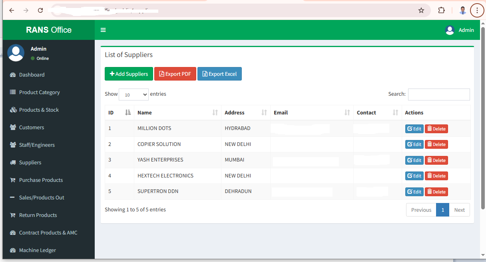
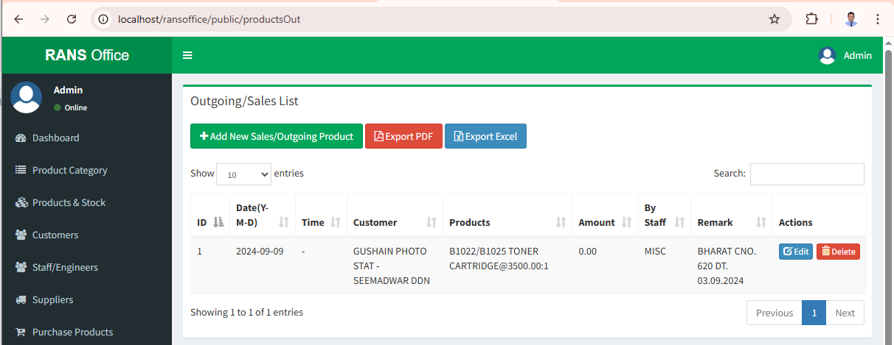

# 🏢 Inventory & Service Management System (Live Project)

A production-level Inventory & Service Management System developed and used in a real business environment for managing machines, spare parts, sales, and service operations.

---

## 🚀 Live Project Highlights

* ✅ Successfully used in real business operations
* ✅ Handles day-to-day inventory and service workflows
* ✅ Improves efficiency and reduces manual work
* ✅ Built based on real client requirements

---

## 🏢 Business Use Case

This system is used by a company dealing with:

* Machine sales and installations
* Spare parts inventory management
* Service and maintenance tracking
* Customer and supplier handling

---

## 🚀 Key Features

* 📦 Inventory Management (Products & Machines)
* 🛒 Sales & Outgoing Products Tracking
* 🔄 Purchase & Return Management
* 🧾 Ledger Management
* 👥 Customer & Supplier Management
* 🧑‍🔧 Staff & Engineer Tracking
* 📊 Dashboard & Reports

---

## 🛠️ Tech Stack

* **Backend:** Laravel (PHP)
* **Frontend:** Blade / Bootstrap / JavaScript
* **Database:** MySQL
* **Server:** Apache (XAMPP)

---

## 📸 Screenshots

### 🔐 Login Screen



### 📊 Dashboard



### 📦 Product Management



### 👥 Customers



### 🏭 Suppliers



### 🛒 Sales



---

## ⚙️ Installation & Setup

```bash
git clone https://github.com/manoj-fullstack-engineer/inventory-service-management-system.git

cd inventory-service-management-system

composer install

cp .env.example .env

php artisan key:generate

php artisan migrate

php artisan serve
```

---

## 🔐 Security Note

This is a **sanitized version** of the live system.
Sensitive data such as client information, credentials, and business data have been removed.

---

## 👨‍💻 Author

**Manoj Prasad**
MBA (IT), MCA, M.Phil
25+ Years Experience in Software Development

---

## 🌏 Career Objective

Seeking IT opportunities in Japan 🇯🇵 where I can contribute my real-world experience in developing enterprise systems such as inventory management, ERP solutions, and service platforms.

---

## ⭐ Support

If you find this project useful, please give it a ⭐ on GitHub.

---
## 📈 Impact

- Reduced manual work by 60%
- Improved service tracking efficiency
- Centralized business operations
